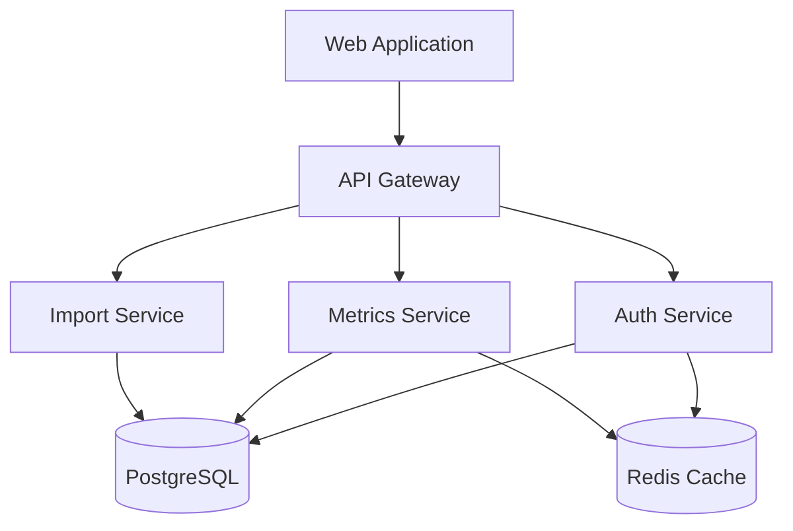

# SaaS Metrics Benchmarking Platform

[](https://github.com/your-repo/saas-metrics/actions)
[](https://codecov.io/gh/your-repo/saas-metrics)
[](https://github.com/your-repo/saas-metrics/security/code-scanning)
[](https://opensource.org/licenses/MIT)

A comprehensive SaaS metrics benchmarking platform providing real-time comparative analytics across different revenue ranges and data sources. Built with enterprise-grade security and scalability on Replit's infrastructure.

## Features

- 🔍 Interactive benchmark data visualization
- 📊 Statistical distribution analysis
- 🎯 Multi-dimensional filtering
- 🔐 Secure administrative interface
- 📈 14 key SaaS performance metrics
- 🚀 Real-time data processing
- 📱 Responsive design
- 🔄 Export capabilities

## Architecture

The platform is built using a modern microservices architecture:



## Prerequisites

- Node.js >= 18.0.0
- npm >= 8.0.0
- Docker >= 20.10.0
- Docker Compose >= 2.0.0
- PostgreSQL 14
- Redis 6.2
- Google Cloud Platform account
- Replit account

## Getting Started

1. Clone the repository:
```bash
git clone https://github.com/your-repo/saas-metrics.git
cd saas-metrics
```

2. Configure environment variables:
```bash
cp .env.example .env
# Edit .env with your configuration
```

3. Start development environment:
```bash
docker-compose up --build
```

4. Access the application:
- Frontend: http://localhost:3000
- API: http://localhost:4000
- API Documentation: http://localhost:4000/api-docs

## Project Structure

```
saas-metrics/
├── src/
│   ├── web/                 # Frontend application
│   ├── backend/            # Backend services
│   │   ├── auth/          # Authentication service
│   │   ├── metrics/       # Metrics processing service
│   │   └── import/        # Data import service
│   └── shared/            # Shared utilities and types
├── docker/                # Docker configurations
├── docs/                  # Additional documentation
├── scripts/              # Utility scripts
└── tests/                # Test suites
```

## Development

### Local Development

```bash
# Start all services
docker-compose up

# Frontend development
docker-compose exec web npm run dev

# Backend development
docker-compose exec api npm run dev

# Run tests
docker-compose exec web npm run test
docker-compose exec api npm run test
```

### Code Style

- ESLint configuration with Airbnb style guide
- Prettier for code formatting
- Husky for pre-commit hooks
- TypeScript strict mode enabled

### Testing

```bash
# Run unit tests
npm run test

# Run integration tests
npm run test:integration

# Generate coverage report
npm run test:coverage

# Run security tests
npm run test:security
```

## Deployment

### Replit Deployment

1. Configure Replit secrets:
   - `DATABASE_URL`
   - `REDIS_URL`
   - `GOOGLE_CLIENT_ID`
   - `GOOGLE_CLIENT_SECRET`
   - `JWT_SECRET`

2. Deploy the application:
```bash
npm run deploy:replit
```

3. Configure domain and SSL in Replit dashboard

### Database Migrations

```bash
# Run migrations
npm run db:migrate

# Rollback migration
npm run db:rollback

# Generate new migration
npm run db:make migration_name
```

## Security

### Authentication

- Google OAuth 2.0 for administrative access
- JWT tokens for API authentication
- Role-based access control (RBAC)
- Secure session management

### Rate Limiting

```typescript
{
  "public": {
    "rate": 100,
    "burst": 50,
    "window": "1m"
  },
  "authenticated": {
    "rate": 1000,
    "burst": 100,
    "window": "1m"
  }
}
```

### Data Protection

- AES-256 encryption for sensitive data
- TLS 1.3 for data in transit
- Regular security audits
- Automated vulnerability scanning

## API Documentation

### Authentication

```bash
# Get access token
POST /api/v1/auth/login
Content-Type: application/json

{
  "code": "google-oauth-code"
}
```

### Endpoints

| Method | Endpoint | Description | Auth Required |
|--------|----------|-------------|---------------|
| GET | /api/v1/metrics | List all metrics | No |
| GET | /api/v1/metrics/{id} | Get metric details | No |
| GET | /api/v1/benchmarks | Get benchmark data | No |
| POST | /api/v1/admin/data | Import data | Yes |
| PUT | /api/v1/admin/sources | Update sources | Yes |

## Monitoring

### Health Checks

```bash
# Application health
GET /health

# Detailed health status
GET /health/detailed
```

### Metrics Collection

- Prometheus metrics exposed at `/metrics`
- Grafana dashboards for visualization
- Custom SLO monitoring
- Error rate tracking
- Performance metrics

## Contributing

1. Fork the repository
2. Create your feature branch (`git checkout -b feature/amazing-feature`)
3. Commit your changes (`git commit -m 'Add amazing feature'`)
4. Push to the branch (`git push origin feature/amazing-feature`)
5. Open a Pull Request

## License

This project is licensed under the MIT License - see the [LICENSE](LICENSE) file for details.

## Support

For support, please open an issue in the GitHub repository or contact the development team.

## Acknowledgments

- [Replit](https://replit.com) for hosting infrastructure
- [Material-UI](https://mui.com) for UI components
- [Chart.js](https://www.chartjs.org) for data visualization