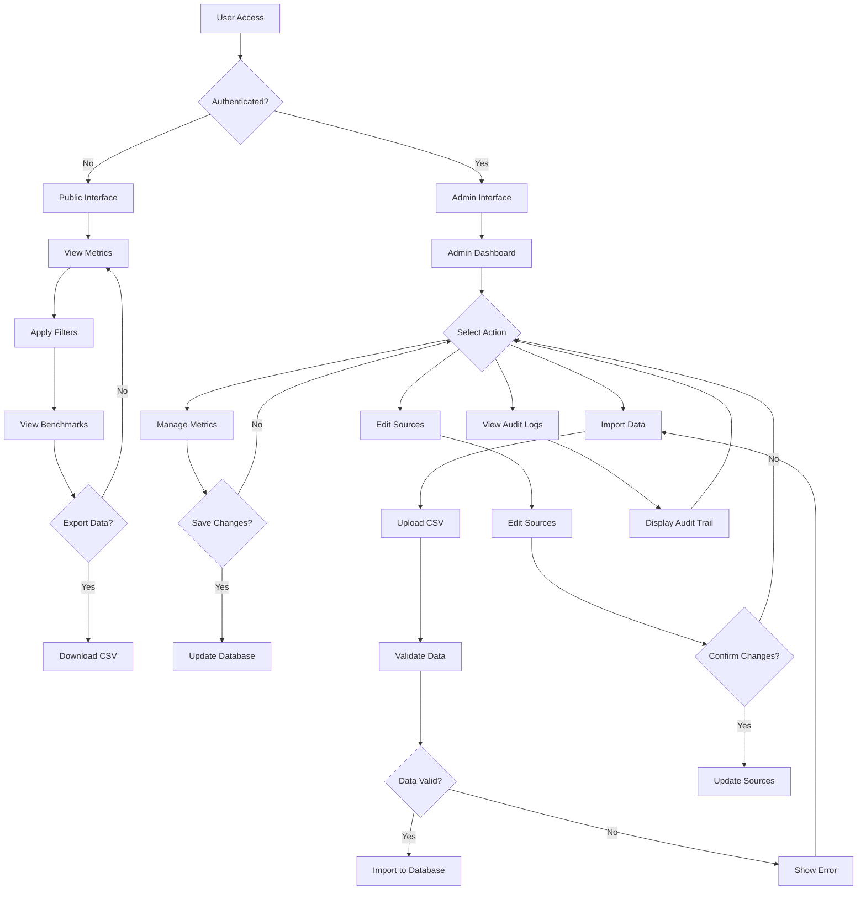
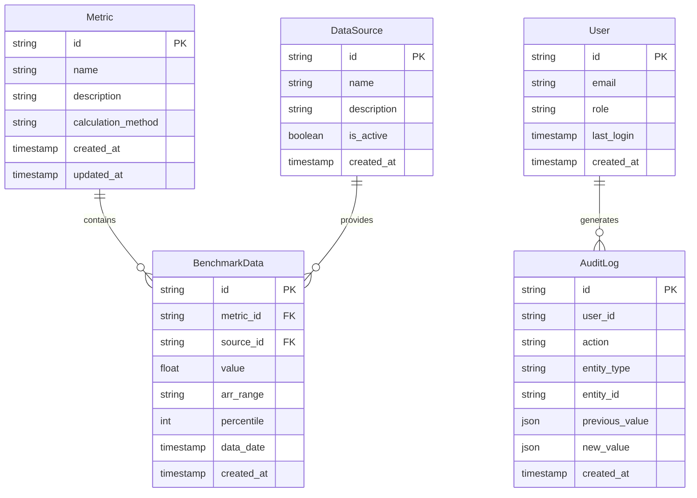
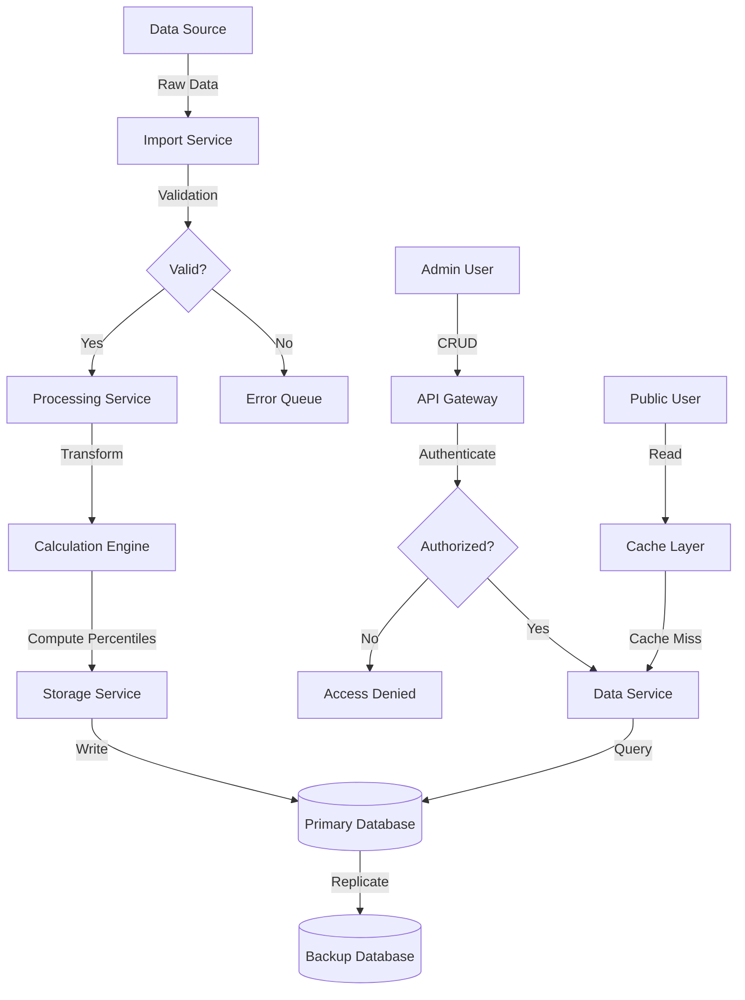

# Product Requirements Document (PRD)

# 1. INTRODUCTION

## 1.1 Purpose

This Product Requirements Document (PRD) specifies the functional and non-functional requirements for a SaaS metrics benchmarking platform. The document serves as a comprehensive guide for developers, project managers, stakeholders, and quality assurance teams involved in the development and deployment of the platform.

## 1.2 Scope

The SaaS metrics benchmarking platform is a web-based application designed to provide comparative analytics across different revenue ranges and data sources. The system will:

- Present benchmark data for 14 key SaaS performance metrics
- Enable data filtering by Annual Recurring Revenue (ARR) ranges and sources
- Display statistical distributions (5th to 90th percentiles) for each metric
- Provide a public-facing interface for data consumption
- Include an administrative backend for data management and maintenance
- Support secure authentication and role-based access control
- Enable data export functionality
- Facilitate bulk data import capabilities
- Maintain audit logs for data modifications

The platform will be developed as a web application compatible with the Replit developer environment, focusing on delivering accurate, real-time benchmark data to help SaaS companies evaluate their performance against industry standards.

# 2. PRODUCT DESCRIPTION

## 2.1 Product Perspective
The SaaS metrics benchmarking platform operates as a standalone web application hosted within the Replit developer environment. It interfaces with:
- Google OAuth 2.0 for authentication services
- External data sources for benchmark information
- Web browsers for user interface delivery
- Database system for data storage and retrieval

## 2.2 Product Functions
The platform provides the following core functions:
- Display and visualization of 14 key SaaS performance metrics
- Statistical distribution calculations (5th to 90th percentiles)
- Data filtering by ARR ranges and sources
- User authentication and authorization
- Administrative data management interface
- Data import/export capabilities
- Audit logging system
- Metric comparison and benchmarking
- Interactive data visualization

## 2.3 User Characteristics

### Public Users
- SaaS company executives and analysts
- Financial professionals and investors
- Technical expertise: Basic to intermediate
- Primary goal: Accessing and comparing benchmark data
- Expected frequency: Regular (weekly/monthly) access

### Administrative Users
- Platform administrators and data managers
- Technical expertise: Intermediate to advanced
- Primary goal: Managing and maintaining benchmark data
- Expected frequency: Regular (daily/weekly) access

## 2.4 Constraints
- Technical Constraints:
  - Must operate within Replit developer environment
  - Browser compatibility requirements
  - Performance limitations of web-based deployment
  - Data storage capacity limitations

- Security Constraints:
  - GDPR and data privacy compliance requirements
  - Secure data transmission requirements
  - Authentication protocol limitations

- Operational Constraints:
  - Regular data updates and maintenance requirements
  - Backup and recovery limitations
  - System availability requirements

## 2.5 Assumptions and Dependencies
### Assumptions
- Users have stable internet connectivity
- Modern web browser availability
- Basic understanding of SaaS metrics
- Regular availability of benchmark data
- Consistent data format from sources

### Dependencies
- Google OAuth 2.0 service availability
- Replit platform stability
- External data source reliability
- Third-party library compatibility
- Database service availability
- Web hosting service performance

# 3. PROCESS FLOWCHART



# 4. FUNCTIONAL REQUIREMENTS

## 4.1 Public Interface Features

### F1: Metric Visualization
**ID**: F1  
**Description**: Display SaaS metrics with statistical distributions  
**Priority**: High  

| Requirement ID | Requirement Description |
|---------------|------------------------|
| F1.1 | Display 14 key SaaS metrics in an interactive table format |
| F1.2 | Show percentile distributions (5th, 25th, 50th, 75th, 90th) for each metric |
| F1.3 | Implement responsive data visualization that adapts to screen sizes |
| F1.4 | Update visualizations in real-time when filters are applied |
| F1.5 | Provide tooltips with metric definitions and calculation methods |

### F2: Data Filtering
**ID**: F2  
**Description**: Filter benchmark data by ARR ranges and sources  
**Priority**: High  

| Requirement ID | Requirement Description |
|---------------|------------------------|
| F2.1 | Implement ARR range filtering (<$1M, $1M-$5M, $5M-$20M, $20M-$50M, >$50M) |
| F2.2 | Enable data source filtering |
| F2.3 | Allow multiple filter selections simultaneously |
| F2.4 | Maintain filter state during user session |
| F2.5 | Display active filters clearly to users |

### F3: Data Export
**ID**: F3  
**Description**: Export filtered benchmark data  
**Priority**: Medium  

| Requirement ID | Requirement Description |
|---------------|------------------------|
| F3.1 | Export data in CSV format |
| F3.2 | Include all visible metrics and their distributions in export |
| F3.3 | Apply current filters to exported data |
| F3.4 | Include metadata about applied filters in export |
| F3.5 | Implement rate limiting for export functionality |

## 4.2 Administrative Features

### F4: Authentication
**ID**: F4  
**Description**: Secure admin access via Google OAuth 2.0  
**Priority**: High  

| Requirement ID | Requirement Description |
|---------------|------------------------|
| F4.1 | Implement Google OAuth 2.0 authentication flow |
| F4.2 | Manage admin user sessions securely |
| F4.3 | Implement role-based access control |
| F4.4 | Provide secure logout functionality |
| F4.5 | Handle authentication errors gracefully |

### F5: Data Management
**ID**: F5  
**Description**: CRUD operations for benchmark data  
**Priority**: High  

| Requirement ID | Requirement Description |
|---------------|------------------------|
| F5.1 | Create new benchmark data entries |
| F5.2 | Update existing benchmark data |
| F5.3 | Delete benchmark data entries |
| F5.4 | Validate data entries against defined schemas |
| F5.5 | Maintain data integrity across operations |

### F6: Bulk Data Import
**ID**: F6  
**Description**: Import benchmark data in bulk  
**Priority**: Medium  

| Requirement ID | Requirement Description |
|---------------|------------------------|
| F6.1 | Accept CSV file uploads |
| F6.2 | Validate imported data format and content |
| F6.3 | Process bulk imports asynchronously |
| F6.4 | Provide import status and error reporting |
| F6.5 | Allow cancellation of ongoing imports |

### F7: Audit Logging
**ID**: F7  
**Description**: Track all data modifications  
**Priority**: Medium  

| Requirement ID | Requirement Description |
|---------------|------------------------|
| F7.1 | Log all data modifications with timestamp |
| F7.2 | Record user information for each modification |
| F7.3 | Store previous and new values for changes |
| F7.4 | Provide searchable audit log interface |
| F7.5 | Implement audit log retention policy |

# 5. NON-FUNCTIONAL REQUIREMENTS

## 5.1 Performance Requirements

| Requirement | Description | Target Metric |
|------------|-------------|---------------|
| Response Time | Maximum time to load benchmark data | < 2 seconds |
| API Response | Maximum time for API endpoints to respond | < 500ms |
| Concurrent Users | Number of simultaneous users supported | 100 users |
| Data Processing | Maximum time for bulk data import processing | < 5 minutes for 10,000 records |
| Page Load | Time to first meaningful paint | < 1.5 seconds |
| Resource Usage | Maximum memory usage per session | < 256MB |
| Database Queries | Maximum query execution time | < 200ms |

## 5.2 Safety Requirements

| Requirement | Description |
|------------|-------------|
| Data Backup | Daily automated backups with 30-day retention |
| Failure Recovery | System recovery time < 4 hours |
| Data Validation | Input validation for all data entry points |
| Error Handling | Graceful error handling with user-friendly messages |
| State Management | Automatic session recovery after connection loss |
| Data Integrity | Transaction rollback for failed operations |

## 5.3 Security Requirements

| Requirement | Description |
|------------|-------------|
| Authentication | Google OAuth 2.0 with MFA for admin access |
| Authorization | Role-based access control (RBAC) |
| Data Encryption | TLS 1.3 for data in transit |
| Session Management | 30-minute session timeout |
| Password Policy | Not applicable (using OAuth) |
| API Security | Rate limiting: 100 requests per minute |
| Data Privacy | Data anonymization for exported datasets |

## 5.4 Quality Requirements

### 5.4.1 Availability
- System uptime: 99.9%
- Scheduled maintenance: < 4 hours per month
- Unplanned downtime: < 1 hour per month

### 5.4.2 Maintainability
- Code documentation coverage: > 80%
- Modular architecture with clear separation of concerns
- Automated testing coverage: > 75%

### 5.4.3 Usability
- Mobile-responsive design
- WCAG 2.1 Level AA compliance
- Maximum of 3 clicks to reach any feature
- Consistent UI/UX patterns across all pages

### 5.4.4 Scalability
- Horizontal scaling capability
- Support for data growth up to 1M records
- Auto-scaling based on user load
- Caching implementation for frequently accessed data

### 5.4.5 Reliability
- Mean Time Between Failures (MTBF): > 720 hours
- Mean Time To Recovery (MTTR): < 2 hours
- Error rate: < 0.1% of all requests
- Data consistency check: Daily

## 5.5 Compliance Requirements

| Requirement | Description |
|------------|-------------|
| GDPR | Compliance with EU data protection regulations |
| CCPA | California Consumer Privacy Act compliance |
| Data Retention | 7-year data retention policy |
| Audit Trail | Complete audit logging of all data modifications |
| Data Export | User data export within 72 hours of request |
| Privacy Policy | Clear display of privacy policy and terms |
| Cookie Compliance | Cookie consent and management system |

# 6. DATA REQUIREMENTS

## 6.1 Data Models



## 6.2 Data Storage

### 6.2.1 Storage Requirements
| Data Type | Storage Format | Estimated Size | Growth Rate |
|-----------|---------------|----------------|-------------|
| Metrics | JSON | 1KB per record | Static |
| Benchmark Data | JSONB | 2KB per record | 100K records/year |
| Audit Logs | JSONB | 1KB per record | 50K records/year |
| User Data | JSON | 1KB per record | 1K records/year |

### 6.2.2 Data Retention
- Benchmark Data: 7 years
- Audit Logs: 3 years
- User Activity Logs: 1 year
- Deleted Records: 30 days in soft-delete state

### 6.2.3 Backup Strategy
- Daily incremental backups
- Weekly full backups
- 30-day backup retention
- Geographic redundancy across multiple regions
- Point-in-time recovery capability within 7 days

## 6.3 Data Processing



### 6.3.1 Data Security
| Layer | Security Measure |
|-------|-----------------|
| Transport | TLS 1.3 encryption |
| Storage | AES-256 encryption at rest |
| Access | Role-based access control |
| API | Rate limiting, JWT tokens |
| Database | Row-level security |

### 6.3.2 Data Validation Rules
- Numeric metrics must be within defined ranges
- ARR ranges must match predefined categories
- Percentile values must be between 0 and 100
- Timestamps must be in ISO 8601 format
- Source references must exist in the system

### 6.3.3 Data Transformation
- Standardization of metric values
- Calculation of statistical distributions
- Normalization of source data formats
- Currency conversion to USD
- Time zone normalization to UTC

# 7. EXTERNAL INTERFACES

## 7.1 User Interfaces

### 7.1.1 Public Interface Requirements

| Component | Description |
|-----------|-------------|
| Layout | Responsive grid layout with minimum width of 320px |
| Navigation | Fixed top navigation bar with filter controls |
| Data Display | Interactive table with sortable columns |
| Filters | Collapsible sidebar with ARR range and source filters |
| Charts | SVG-based statistical distribution visualizations |
| Export | Prominent export button in the top-right corner |

### 7.1.2 Administrative Interface Requirements

| Component | Description |
|-----------|-------------|
| Dashboard | Grid layout with metric cards and quick actions |
| Data Management | CRUD forms with validation feedback |
| Bulk Import | Drag-and-drop file upload area with progress indicator |
| Audit Logs | Paginated table with search and filter capabilities |
| Navigation | Left sidebar with collapsible menu structure |

## 7.2 Software Interfaces

### 7.2.1 Authentication Service

| Interface | Specification |
|-----------|--------------|
| Protocol | OAuth 2.0 |
| Provider | Google Identity Platform |
| Scope | email, profile |
| Response Format | JWT token |

### 7.2.2 Database Interface

| Interface | Specification |
|-----------|--------------|
| Type | PostgreSQL |
| Version | 14.x or higher |
| Connection | Connection pooling with max 20 connections |
| Query Interface | Prepared statements |

### 7.2.3 Caching Interface

| Interface | Specification |
|-----------|--------------|
| Type | Redis |
| Version | 6.x or higher |
| Protocol | RESP |
| Data Format | JSON |

## 7.3 Communication Interfaces

### 7.3.1 API Endpoints

| Endpoint Type | Protocol | Format |
|--------------|----------|---------|
| REST API | HTTPS | JSON |
| WebSocket | WSS | JSON |
| Export API | HTTPS | CSV |

### 7.3.2 Network Requirements

| Requirement | Specification |
|-------------|--------------|
| Protocol | HTTPS/TLS 1.3 |
| Port | 443 |
| API Rate Limiting | 100 requests/minute |
| Maximum Payload | 10MB |
| Timeout | 30 seconds |

### 7.3.3 Data Exchange Formats

```json
{
  "metric_data": {
    "version": "1.0",
    "format": "application/json",
    "encoding": "UTF-8",
    "schema": {
      "metric_id": "string",
      "value": "number",
      "percentile": "number",
      "arr_range": "string",
      "source": "string",
      "timestamp": "ISO8601"
    }
  }
}
```

# 8. APPENDICES

## 8.1 GLOSSARY

| Term | Definition |
|------|------------|
| Annual Recurring Revenue (ARR) | The yearly value of subscription-based revenue normalized to a 12-month period |
| Net Dollar Retention (NDR) | Measure of revenue retained from existing customers including expansions and contractions |
| Gross Retention (GR) | Measure of revenue retained from existing customers excluding expansions |
| Pipeline Coverage | Ratio of sales pipeline value to revenue target |
| Magic Number | Efficiency metric calculated as net new ARR divided by sales and marketing spend |
| Payback Period | Time required to recover customer acquisition cost |
| EBITDA Margin | Earnings Before Interest, Taxes, Depreciation, and Amortization as a percentage of revenue |
| NTM Revenue Multiple | Next Twelve Months revenue multiple used for company valuation |

## 8.2 ACRONYMS

| Acronym | Expansion |
|---------|-----------|
| API | Application Programming Interface |
| ARR | Annual Recurring Revenue |
| CRUD | Create, Read, Update, Delete |
| CSV | Comma-Separated Values |
| G&A | General and Administrative |
| GDPR | General Data Protection Regulation |
| JWT | JSON Web Token |
| KPI | Key Performance Indicator |
| MFA | Multi-Factor Authentication |
| NDR | Net Dollar Retention |
| NTM | Next Twelve Months |
| OAuth | Open Authorization |
| RBAC | Role-Based Access Control |
| R&D | Research and Development |
| SaaS | Software as a Service |
| TLS | Transport Layer Security |
| UI/UX | User Interface/User Experience |
| UTC | Coordinated Universal Time |
| WCAG | Web Content Accessibility Guidelines |

## 8.3 ADDITIONAL REFERENCES

| Reference | Description | URL |
|-----------|-------------|-----|
| Google OAuth 2.0 | Authentication implementation guide | https://developers.google.com/identity/protocols/oauth2 |
| Replit Documentation | Developer environment documentation | https://docs.replit.com/ |
| PostgreSQL Documentation | Database reference | https://www.postgresql.org/docs/ |
| Redis Documentation | Caching system reference | https://redis.io/documentation |
| WCAG 2.1 Guidelines | Web accessibility standards | https://www.w3.org/WAI/WCAG21/Understanding/ |