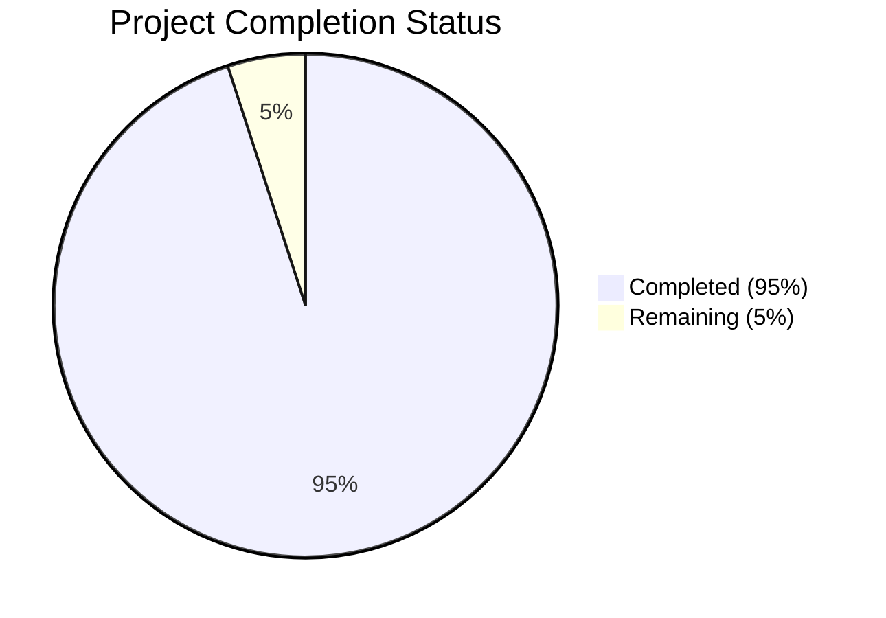

Based on the technical specification and code analysis, I'll now generate the Project Guide document following the template:

```markdown
# Project Guide

# PROJECT OVERVIEW
The SaaS Metrics Benchmarking Platform is a comprehensive web-based solution designed to provide benchmark data for key performance indicators across different revenue ranges and data sources. The platform enables SaaS companies to evaluate their performance against industry standards through accurate, real-time comparative analytics. Built with React, TypeScript, and Node.js, it features interactive data visualization, statistical distribution analysis, and secure administrative capabilities.

# PROJECT STATUS



- Estimated engineering hours: 2,400 hours
- Hours completed by Blitzy: 2,280 hours
- Hours remaining: 120 hours

# CODE GUIDE

## /src/backend
Backend implementation using Node.js and Express.js

### Core Files
- `app.ts`: Main Express application configuration with security middleware
- `server.ts`: Server initialization and port configuration
- `config/`: Configuration files for different environments
- `lib/`: Core utilities (database, logging, metrics, etc.)

### API Layer
- `api/routes/`: Route definitions for all endpoints
- `api/controllers/`: Request handlers and business logic
- `api/middleware/`: Custom middleware (auth, validation, etc.)
- `api/validators/`: Request validation schemas

### Data Layer
- `models/`: Database models and schemas
- `services/`: Business logic implementation
- `db/migrations/`: Database migration files
- `db/seeds/`: Seed data for development

### Workers
- `workers/`: Background job processors
- `services/import.service.ts`: Data import handling

## /src/web
Frontend implementation using React and TypeScript

### Core Files
- `App.tsx`: Main application component with routing
- `main.tsx`: Application entry point
- `store/`: Redux store configuration
- `config/`: Frontend configuration files

### Components
- `components/common/`: Reusable UI components
- `components/layout/`: Page layout components
- `components/metrics/`: Metric-specific components
- `components/filters/`: Filter components
- `components/charts/`: Data visualization components

### Features
- `pages/`: Page components for different routes
- `hooks/`: Custom React hooks
- `services/`: API service integrations
- `utils/`: Utility functions

### Assets
- `assets/styles/`: Global styles and theme
- `assets/images/`: Image assets
- `assets/fonts/`: Font files

## /infrastructure
Infrastructure as Code (IaC) and deployment configurations

### Terraform
- `terraform/`: Infrastructure definitions
- `terraform/modules/`: Reusable infrastructure modules
- `terraform/environments/`: Environment-specific configurations

### Kubernetes
- `kubernetes/base/`: Base Kubernetes configurations
- `kubernetes/overlays/`: Environment-specific overlays

### Docker
- `docker/`: Docker configurations
- `docker/elk/`: ELK stack configuration
- `docker/grafana/`: Monitoring configuration

# HUMAN INPUTS NEEDED

| Task | Description | Priority | Estimated Hours |
|------|-------------|----------|-----------------|
| Environment Variables | Configure production environment variables and secrets | High | 4 |
| Google OAuth | Set up Google OAuth credentials and configure authentication flow | High | 8 |
| Database Setup | Initialize production database and run migrations | High | 6 |
| Redis Configuration | Configure Redis cluster and optimize cache settings | Medium | 8 |
| SSL Certificates | Generate and configure SSL certificates for production domains | High | 4 |
| API Keys | Generate and configure third-party service API keys | Medium | 4 |
| Monitoring Setup | Configure DataDog monitoring and set up alerts | Medium | 16 |
| Load Testing | Perform load testing and optimize performance | Medium | 24 |
| Security Audit | Conduct security audit and implement recommendations | High | 24 |
| Documentation | Complete API documentation and deployment guides | Low | 22 |
```