# Technical Specifications

# 1. INTRODUCTION

## 1.1 EXECUTIVE SUMMARY

The SaaS Metrics Benchmarking Platform is a web-based solution designed to provide comprehensive benchmark data for key performance indicators across different revenue ranges and data sources. The platform addresses the critical need for SaaS companies to evaluate their performance against industry standards through accurate, real-time comparative analytics. Primary stakeholders include SaaS company executives, financial analysts, and investors who require reliable benchmark data for decision-making. The platform will deliver significant value by enabling data-driven strategic planning and performance optimization through transparent, accessible industry metrics.

## 1.2 SYSTEM OVERVIEW

### Project Context

| Aspect | Description |
|--------|-------------|
| Market Position | First-of-its-kind comprehensive SaaS metrics benchmarking tool within the Replit ecosystem |
| Current Limitations | Manual data collection and analysis processes, fragmented data sources, lack of standardized metrics |
| Enterprise Integration | Standalone web application with Google OAuth integration for secure administrative access |

### High-Level Description

| Component | Details |
|-----------|----------|
| Primary Capabilities | - Interactive benchmark data visualization<br>- Statistical distribution analysis<br>- Multi-dimensional filtering<br>- Administrative data management |
| Architecture | - Web-based application<br>- RESTful API architecture<br>- PostgreSQL database<br>- Redis caching layer |
| Core Components | - Public frontend interface<br>- Administrative backend<br>- Data processing engine<br>- Authentication system |
| Technical Approach | - Modern web stack<br>- Microservices architecture<br>- Real-time data processing<br>- Secure API endpoints |

### Success Criteria

| Criterion | Target Metric |
|-----------|--------------|
| System Performance | Response time < 2 seconds for data retrieval |
| Data Accuracy | 99.9% data validation success rate |
| User Adoption | 1000+ monthly active users within 6 months |
| System Availability | 99.9% uptime excluding planned maintenance |

## 1.3 SCOPE

### In-Scope Elements

#### Core Features and Functionalities

| Category | Components |
|----------|------------|
| Data Visualization | - 14 key SaaS metrics<br>- Percentile distributions<br>- Interactive filtering<br>- Export capabilities |
| User Management | - Public access controls<br>- Administrative functions<br>- Role-based permissions |
| Data Management | - CRUD operations<br>- Bulk import/export<br>- Audit logging<br>- Data validation |
| Security | - Google OAuth integration<br>- RBAC implementation<br>- Secure data transmission |

#### Implementation Boundaries

| Boundary Type | Coverage |
|--------------|----------|
| System Access | Web-based interface accessible via modern browsers |
| User Groups | Public users and administrative users |
| Geographic Coverage | Global access with UTC time standardization |
| Data Domains | SaaS performance metrics and benchmark data |

### Out-of-Scope Elements

- Custom metric definition by end users
- Real-time data integration with external systems
- Mobile native applications
- Predictive analytics and forecasting
- Individual company performance tracking
- Historical trend analysis beyond 7 years
- Custom reporting templates
- Third-party API integrations beyond Google OAuth
- White-label solutions
- Multi-language support

# 2. SYSTEM ARCHITECTURE

## 2.1 High-Level Architecture

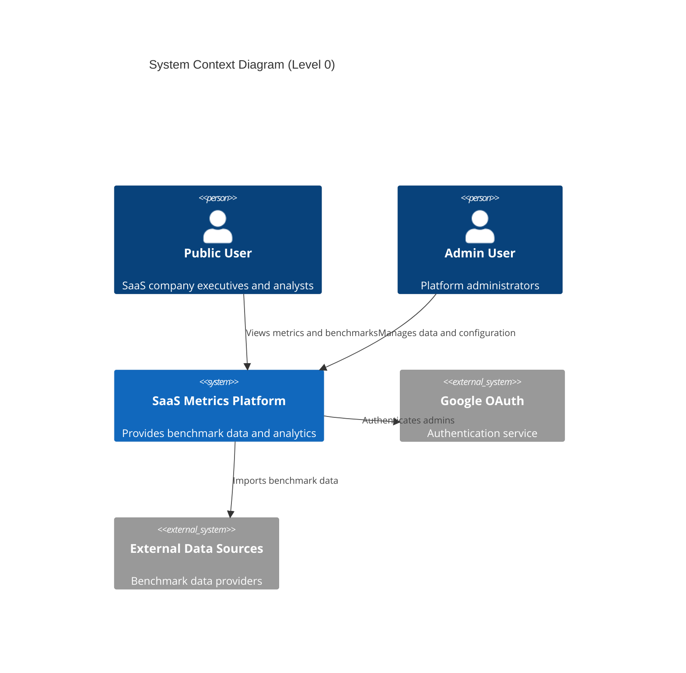
```mermaid
C4Context
    title System Context Diagram (Level 0)
    
    Person(user, "Public User", "SaaS company executives and analysts")
    Person(admin, "Admin User", "Platform administrators")
    
    System(platform, "SaaS Metrics Platform", "Provides benchmark data and analytics")
    
    System_Ext(google, "Google OAuth", "Authentication service")
    System_Ext(data_sources, "External Data Sources", "Benchmark data providers")
    
    Rel(user, platform, "Views metrics and benchmarks")
    Rel(admin, platform, "Manages data and configuration")
    Rel(platform, google, "Authenticates admins")
    Rel(platform, data_sources, "Imports benchmark data")
```

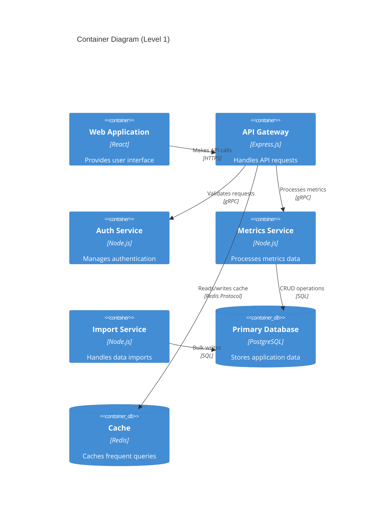
```mermaid
C4Container
    title Container Diagram (Level 1)
    
    Container(web_app, "Web Application", "React", "Provides user interface")
    Container(api, "API Gateway", "Express.js", "Handles API requests")
    Container(auth, "Auth Service", "Node.js", "Manages authentication")
    Container(metrics, "Metrics Service", "Node.js", "Processes metrics data")
    Container(import, "Import Service", "Node.js", "Handles data imports")
    
    ContainerDb(db, "Primary Database", "PostgreSQL", "Stores application data")
    ContainerDb(cache, "Cache", "Redis", "Caches frequent queries")
    
    Rel(web_app, api, "Makes API calls", "HTTPS")
    Rel(api, auth, "Validates requests", "gRPC")
    Rel(api, metrics, "Processes metrics", "gRPC")
    Rel(api, cache, "Reads/writes cache", "Redis Protocol")
    Rel(metrics, db, "CRUD operations", "SQL")
    Rel(import, db, "Bulk writes", "SQL")
```

## 2.2 Component Details

### 2.2.1 Web Application
| Aspect | Specification |
|--------|---------------|
| Technology | React, TypeScript |
| State Management | Redux Toolkit |
| UI Framework | Material-UI |
| Build Tool | Vite |
| Testing | Jest, React Testing Library |

### 2.2.2 API Gateway
| Aspect | Specification |
|--------|---------------|
| Framework | Express.js |
| Authentication | JWT, OAuth 2.0 |
| Rate Limiting | Redis-based |
| Documentation | OpenAPI 3.0 |
| Monitoring | Prometheus metrics |

### 2.2.3 Service Components
| Service | Purpose | Technology | Scaling Strategy |
|---------|---------|------------|------------------|
| Auth Service | User authentication and authorization | Node.js, Passport | Horizontal |
| Metrics Service | Metrics processing and analytics | Node.js, NumJS | Vertical |
| Import Service | Data import and validation | Node.js, Bull | Horizontal |
| Cache Service | Query result caching | Redis | Memory scaling |

## 2.3 Technical Decisions

### 2.3.1 Architecture Pattern
| Decision | Rationale |
|----------|-----------|
| Microservices | - Enables independent scaling<br>- Supports team autonomy<br>- Facilitates continuous deployment |

### 2.3.2 Data Storage
| Component | Technology | Justification |
|-----------|------------|---------------|
| Primary Database | PostgreSQL | - ACID compliance<br>- JSON support<br>- Robust indexing |
| Cache Layer | Redis | - High performance<br>- Built-in data structures<br>- Pub/sub support |
| File Storage | S3-compatible | - Scalable object storage<br>- Cost-effective<br>- High durability |

## 2.4 Cross-Cutting Concerns

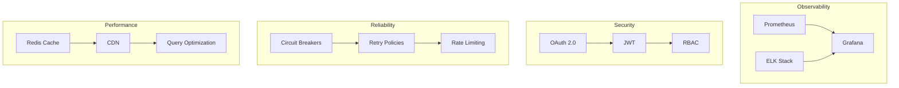
```mermaid
graph TB
    subgraph Observability
        A[Prometheus] --> B[Grafana]
        C[ELK Stack] --> B
    end
    
    subgraph Security
        D[OAuth 2.0] --> E[JWT]
        E --> F[RBAC]
    end
    
    subgraph Reliability
        G[Circuit Breakers] --> H[Retry Policies]
        H --> I[Rate Limiting]
    end
    
    subgraph Performance
        J[Redis Cache] --> K[CDN]
        K --> L[Query Optimization]
    end
```

### 2.4.1 Monitoring Strategy
| Component | Tool | Metrics |
|-----------|------|---------|
| Application | Prometheus | Request rates, latencies, errors |
| Infrastructure | Node Exporter | CPU, memory, disk usage |
| Logs | ELK Stack | Error logs, audit trails |
| Traces | Jaeger | Request traces, bottlenecks |

## 2.5 Deployment Architecture

```mermaid
C4Deployment
    title Deployment Diagram
    
    Deployment_Node(cdn, "CDN", "CloudFlare"){
        Container(static, "Static Assets")
    }
    
    Deployment_Node(app, "Application Tier", "Replit"){
        Container(web, "Web Servers")
        Container(services, "Microservices")
    }
    
    Deployment_Node(data, "Data Tier", "Managed Services"){
        ContainerDb(postgres, "PostgreSQL")
        ContainerDb(redis, "Redis")
    }
    
    Rel(cdn, web, "Serves static content", "HTTPS")
    Rel(web, services, "Internal communication", "gRPC")
    Rel(services, postgres, "Persistent storage", "SQL")
    Rel(services, redis, "Caching", "Redis Protocol")
```

### 2.5.1 Data Flow Patterns

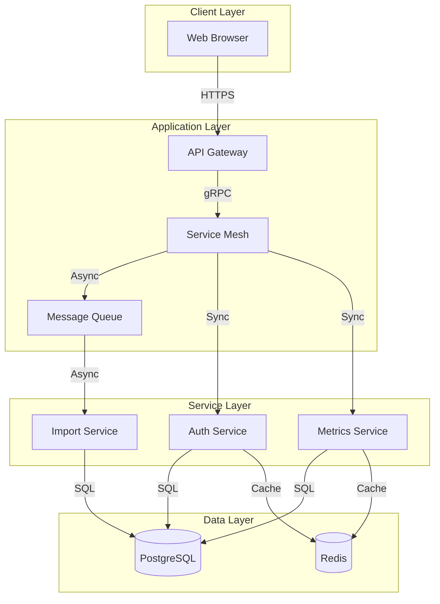
```mermaid
flowchart TD
    subgraph Client Layer
        A[Web Browser]
    end
    
    subgraph Application Layer
        B[API Gateway]
        C[Service Mesh]
        D[Message Queue]
    end
    
    subgraph Service Layer
        E[Auth Service]
        F[Metrics Service]
        G[Import Service]
    end
    
    subgraph Data Layer
        H[(PostgreSQL)]
        I[(Redis)]
    end
    
    A -->|HTTPS| B
    B -->|gRPC| C
    C -->|Async| D
    C -->|Sync| E
    C -->|Sync| F
    D -->|Async| G
    E & F & G -->|SQL| H
    E & F -->|Cache| I
```

# 3. SYSTEM COMPONENTS ARCHITECTURE

## 3.1 USER INTERFACE DESIGN

### 3.1.1 Design Specifications

| Aspect | Requirements |
|--------|--------------|
| Visual Hierarchy | - F-pattern layout for metric displays<br>- Z-pattern for action flows<br>- Card-based metric presentation<br>- Consistent spacing (8px grid system) |
| Component Library | Material-UI v5 with custom theme |
| Responsive Breakpoints | - Mobile: 320px - 767px<br>- Tablet: 768px - 1023px<br>- Desktop: 1024px+ |
| Accessibility | WCAG 2.1 Level AA compliance |
| Browser Support | - Chrome 90+<br>- Firefox 88+<br>- Safari 14+<br>- Edge 90+ |
| Theme Support | Light mode only (Phase 1) |
| Internationalization | English only (Phase 1) |

### 3.1.2 Interface Elements

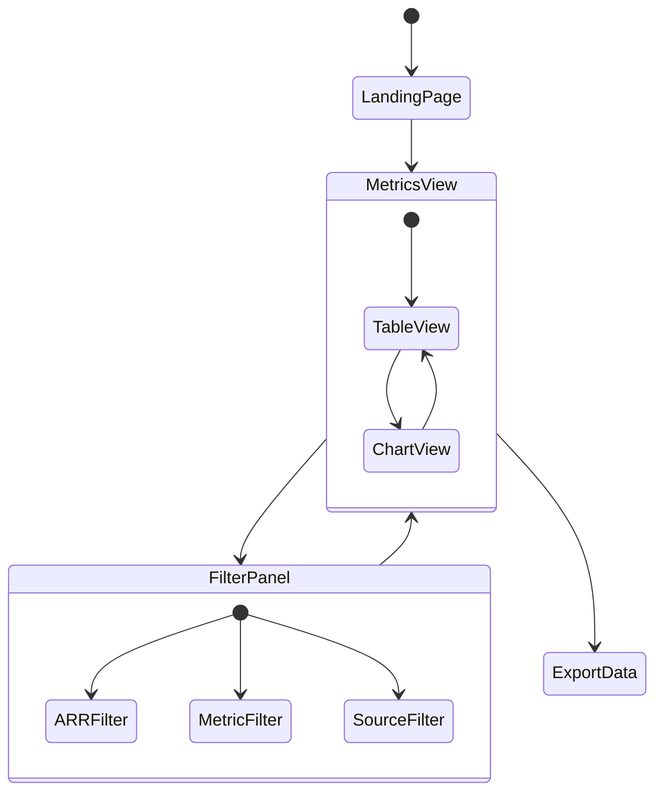
```mermaid
stateDiagram-v2
    [*] --> LandingPage
    LandingPage --> MetricsView
    MetricsView --> FilterPanel
    FilterPanel --> MetricsView
    MetricsView --> ExportData
    
    state FilterPanel {
        [*] --> ARRFilter
        [*] --> MetricFilter
        [*] --> SourceFilter
    }
    
    state MetricsView {
        [*] --> TableView
        TableView --> ChartView
        ChartView --> TableView
    }
```

#### Navigation Structure

| Level | Components |
|-------|------------|
| Primary | - Metrics Dashboard<br>- Data Sources<br>- Export<br>- Admin Panel (authenticated) |
| Secondary | - Metric Details<br>- Comparison Views<br>- Historical Trends |
| Utility | - Help/Documentation<br>- User Settings<br>- Authentication |

#### Critical User Flows

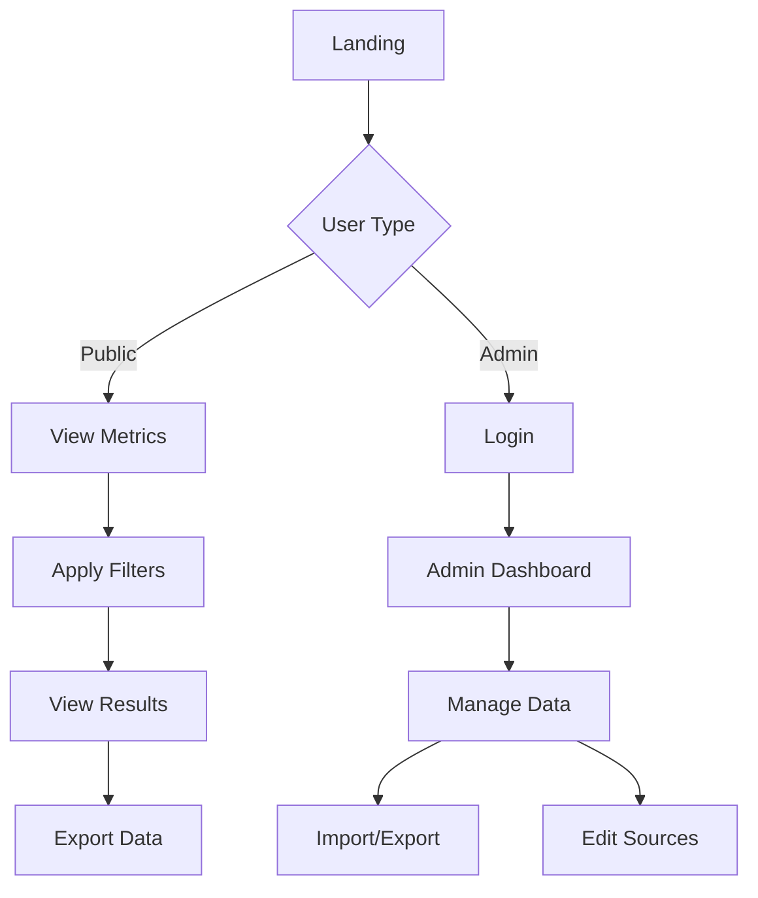
```mermaid
graph TD
    A[Landing] --> B{User Type}
    B -->|Public| C[View Metrics]
    B -->|Admin| D[Login]
    C --> E[Apply Filters]
    E --> F[View Results]
    F --> G[Export Data]
    D --> H[Admin Dashboard]
    H --> I[Manage Data]
    I --> J[Import/Export]
    I --> K[Edit Sources]
```

## 3.2 DATABASE DESIGN

### 3.2.1 Schema Design

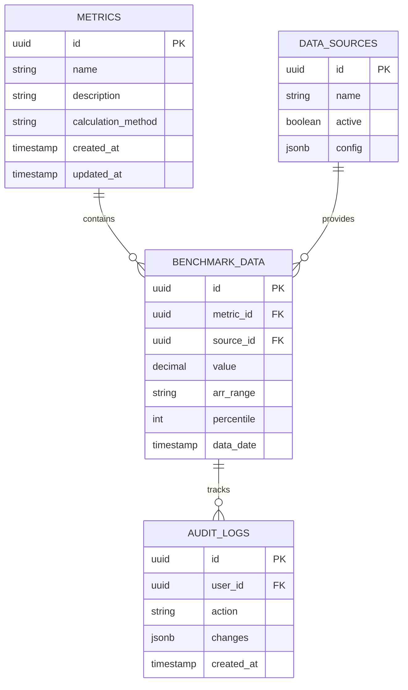
```mermaid
erDiagram
    METRICS {
        uuid id PK
        string name
        string description
        string calculation_method
        timestamp created_at
        timestamp updated_at
    }
    
    BENCHMARK_DATA {
        uuid id PK
        uuid metric_id FK
        uuid source_id FK
        decimal value
        string arr_range
        int percentile
        timestamp data_date
    }
    
    DATA_SOURCES {
        uuid id PK
        string name
        boolean active
        jsonb config
    }
    
    AUDIT_LOGS {
        uuid id PK
        uuid user_id FK
        string action
        jsonb changes
        timestamp created_at
    }
    
    METRICS ||--o{ BENCHMARK_DATA : contains
    DATA_SOURCES ||--o{ BENCHMARK_DATA : provides
    BENCHMARK_DATA ||--o{ AUDIT_LOGS : tracks
```

### 3.2.2 Data Management

| Aspect | Strategy |
|--------|----------|
| Migrations | - Versioned migrations using Knex.js<br>- Forward-only migration policy<br>- Automated testing of migrations |
| Versioning | Semantic versioning for schema changes |
| Retention | - Active data: 7 years<br>- Audit logs: 3 years<br>- Soft deletes: 30 days |
| Archival | Monthly archival to cold storage after 2 years |

### 3.2.3 Performance Optimization

| Component | Strategy |
|-----------|----------|
| Indexing | - B-tree indexes on frequently queried columns<br>- Composite indexes for common query patterns |
| Partitioning | Range partitioning by data_date for benchmark_data |
| Caching | - Redis cache for frequently accessed metrics<br>- 15-minute TTL for public data<br>- Cache invalidation on updates |

## 3.3 API DESIGN

### 3.3.1 API Architecture

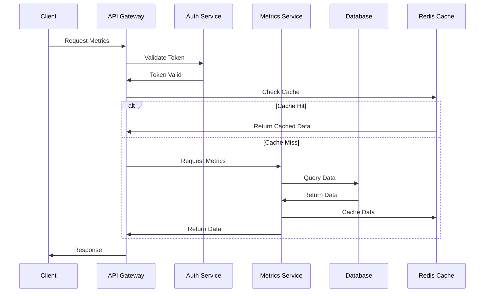
```mermaid
sequenceDiagram
    participant C as Client
    participant G as API Gateway
    participant A as Auth Service
    participant M as Metrics Service
    participant D as Database
    participant R as Redis Cache

    C->>G: Request Metrics
    G->>A: Validate Token
    A->>G: Token Valid
    G->>R: Check Cache
    alt Cache Hit
        R->>G: Return Cached Data
    else Cache Miss
        G->>M: Request Metrics
        M->>D: Query Data
        D->>M: Return Data
        M->>R: Cache Data
        M->>G: Return Data
    end
    G->>C: Response
```

### 3.3.2 Interface Specifications

| Endpoint | Method | Description | Auth Required |
|----------|--------|-------------|---------------|
| /api/v1/metrics | GET | List all metrics | No |
| /api/v1/metrics/{id} | GET | Get metric details | No |
| /api/v1/benchmarks | GET | Get benchmark data | No |
| /api/v1/admin/data | POST | Import data | Yes |
| /api/v1/admin/sources | PUT | Update sources | Yes |

#### Request/Response Format

```json
{
  "metric": {
    "id": "uuid",
    "name": "string",
    "value": "number",
    "percentiles": {
      "p5": "number",
      "p25": "number",
      "p50": "number",
      "p75": "number",
      "p90": "number"
    },
    "metadata": {
      "source": "string",
      "arr_range": "string",
      "updated_at": "timestamp"
    }
  }
}
```

### 3.3.3 Integration Requirements

| Component | Specification |
|-----------|--------------|
| Rate Limiting | - 100 requests/minute for public endpoints<br>- 1000 requests/minute for authenticated endpoints |
| Circuit Breaker | - 5 second timeout<br>- 3 retries with exponential backoff<br>- 60 second reset time |
| API Gateway | - Kong Gateway with custom plugins<br>- JWT validation<br>- Request transformation<br>- Response caching |
| Documentation | OpenAPI 3.0 specification with SwaggerUI |

# 4. TECHNOLOGY STACK

## 4.1 PROGRAMMING LANGUAGES

| Platform/Component | Language | Version | Justification |
|-------------------|----------|---------|---------------|
| Frontend | TypeScript | 5.0+ | - Strong typing for maintainability<br>- Enhanced IDE support<br>- Better error detection |
| Backend Services | Node.js | 18 LTS | - JavaScript ecosystem compatibility<br>- Event-driven architecture support<br>- Excellent package ecosystem |
| Database Scripts | SQL | PostgreSQL 14+ | - ACID compliance requirements<br>- Complex query support<br>- JSON capabilities |

## 4.2 FRAMEWORKS & LIBRARIES

### 4.2.1 Core Frameworks

| Component | Framework | Version | Justification |
|-----------|-----------|---------|---------------|
| Frontend UI | React | 18.2+ | - Component reusability<br>- Virtual DOM performance<br>- Extensive ecosystem |
| UI Components | Material-UI | 5.x | - Consistent design system<br>- Accessibility support<br>- Responsive components |
| State Management | Redux Toolkit | 1.9+ | - Centralized state management<br>- DevTools integration<br>- Immutable updates |
| Backend API | Express.js | 4.18+ | - Middleware ecosystem<br>- Route handling<br>- Performance optimization |
| API Documentation | OpenAPI | 3.0 | - Standard specification<br>- Code generation<br>- Interactive documentation |

### 4.2.2 Supporting Libraries

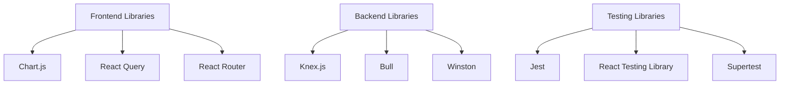
```mermaid
graph TD
    A[Frontend Libraries] --> B[Chart.js]
    A --> C[React Query]
    A --> D[React Router]
    
    E[Backend Libraries] --> F[Knex.js]
    E --> G[Bull]
    E --> H[Winston]
    
    I[Testing Libraries] --> J[Jest]
    I --> K[React Testing Library]
    I --> L[Supertest]
```

## 4.3 DATABASES & STORAGE

### 4.3.1 Database Architecture

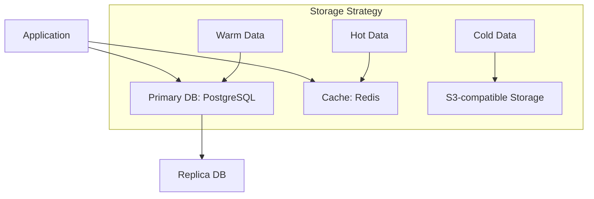
```mermaid
graph TD
    A[Application] --> B[Primary DB: PostgreSQL]
    A --> C[Cache: Redis]
    B --> D[Replica DB]
    
    subgraph Storage Strategy
        E[Hot Data] --> C
        F[Warm Data] --> B
        G[Cold Data] --> H[S3-compatible Storage]
    end
```

| Component | Technology | Purpose | Configuration |
|-----------|------------|---------|---------------|
| Primary Database | PostgreSQL 14 | Transactional data | - Connection pooling: 20<br>- Max connections: 100<br>- SSL mode: require |
| Cache Layer | Redis 6.2 | Performance optimization | - Max memory: 2GB<br>- Eviction policy: allkeys-lru<br>- Persistence: RDB |
| Object Storage | S3-compatible | Static assets & backups | - Bucket lifecycle rules<br>- Versioning enabled<br>- Server-side encryption |

## 4.4 THIRD-PARTY SERVICES

| Service | Provider | Purpose | Integration Method |
|---------|----------|---------|-------------------|
| Authentication | Google OAuth 2.0 | Admin access | OAuth 2.0 flow with JWT |
| Monitoring | Prometheus/Grafana | System metrics | Metrics exposition & scraping |
| Logging | ELK Stack | Log aggregation | Log shipping via Filebeat |
| CDN | Cloudflare | Static asset delivery | DNS integration |

### 4.4.1 Service Dependencies

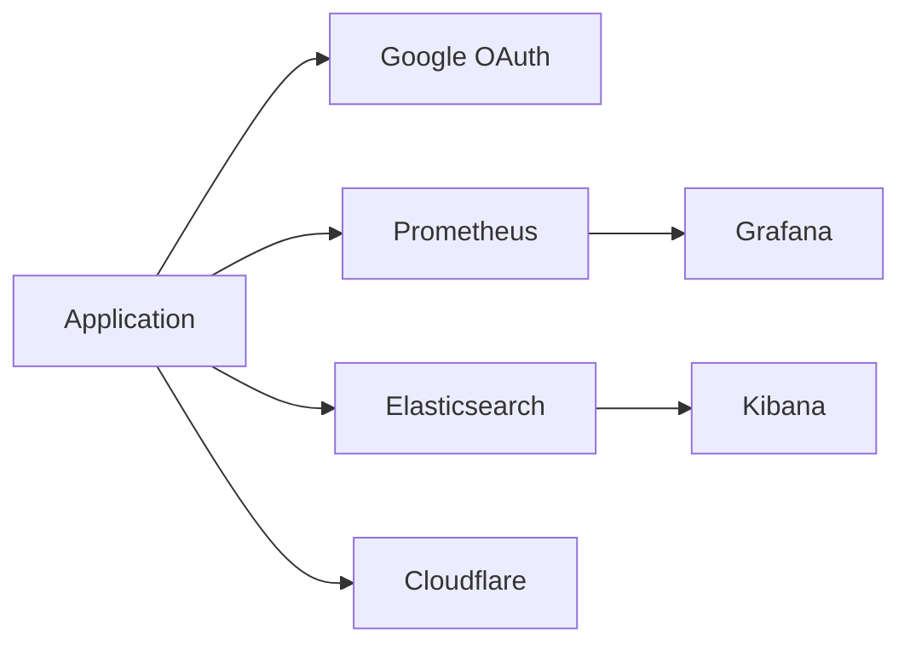
```mermaid
graph LR
    A[Application] --> B[Google OAuth]
    A --> C[Prometheus]
    C --> D[Grafana]
    A --> E[Elasticsearch]
    E --> F[Kibana]
    A --> G[Cloudflare]
```

## 4.5 DEVELOPMENT & DEPLOYMENT

### 4.5.1 Development Environment

| Tool | Purpose | Configuration |
|------|---------|---------------|
| Vite | Build system | - Hot module replacement<br>- TypeScript support<br>- Production optimization |
| ESLint | Code quality | - Airbnb style guide<br>- TypeScript rules<br>- React hooks rules |
| Prettier | Code formatting | - 2 space indentation<br>- Single quotes<br>- Trailing commas |
| Husky | Git hooks | - Pre-commit formatting<br>- Pre-push tests<br>- Branch naming |

### 4.5.2 Deployment Pipeline

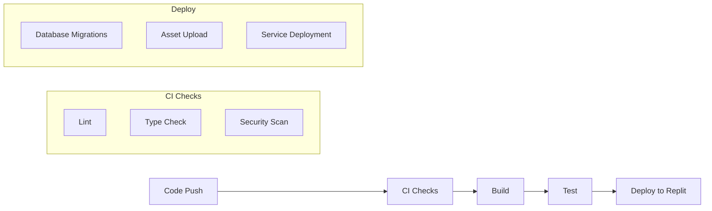
```mermaid
graph LR
    A[Code Push] --> B[CI Checks]
    B --> C[Build]
    C --> D[Test]
    D --> E[Deploy to Replit]
    
    subgraph CI Checks
        F[Lint]
        G[Type Check]
        H[Security Scan]
    end
    
    subgraph Deploy
        I[Database Migrations]
        J[Asset Upload]
        K[Service Deployment]
    end
```

### 4.5.3 Environment Configuration

| Environment | Purpose | Configuration |
|-------------|---------|---------------|
| Development | Local development | - Local PostgreSQL<br>- Redis Docker container<br>- Mock OAuth |
| Staging | Integration testing | - Staging database<br>- Full service stack<br>- Test data |
| Production | Live environment | - Production database<br>- Redis cluster<br>- Full monitoring |

# 5. SYSTEM DESIGN

## 5.1 USER INTERFACE DESIGN

### 5.1.1 Layout Structure

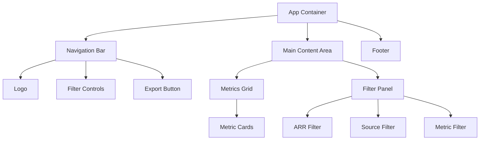
```mermaid
graph TD
    A[App Container] --> B[Navigation Bar]
    A --> C[Main Content Area]
    A --> D[Footer]
    
    B --> E[Logo]
    B --> F[Filter Controls]
    B --> G[Export Button]
    
    C --> H[Metrics Grid]
    C --> I[Filter Panel]
    
    H --> J[Metric Cards]
    I --> K[ARR Filter]
    I --> L[Source Filter]
    I --> M[Metric Filter]
```

### 5.1.2 Component Specifications

| Component | Specifications |
|-----------|----------------|
| Navigation Bar | - Fixed position<br>- Height: 64px<br>- Contains: Logo, Filter Toggle, Export |
| Filter Panel | - Width: 280px<br>- Collapsible on mobile<br>- Sticky position |
| Metrics Grid | - Responsive grid layout<br>- Card-based presentation<br>- 3 columns on desktop |
| Metric Cards | - Material elevation: 2<br>- Padding: 16px<br>- Interactive hover state |

### 5.1.3 Responsive Breakpoints

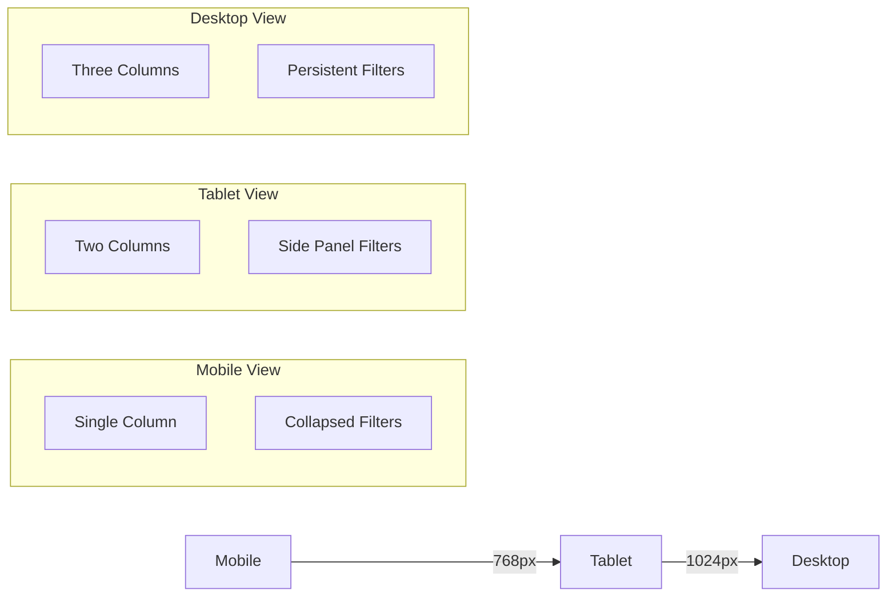
```mermaid
graph LR
    A[Mobile] -->|768px| B[Tablet]
    B -->|1024px| C[Desktop]
    
    subgraph Mobile View
        D[Single Column]
        E[Collapsed Filters]
    end
    
    subgraph Tablet View
        F[Two Columns]
        G[Side Panel Filters]
    end
    
    subgraph Desktop View
        H[Three Columns]
        I[Persistent Filters]
    end
```

## 5.2 DATABASE DESIGN

### 5.2.1 Schema Design

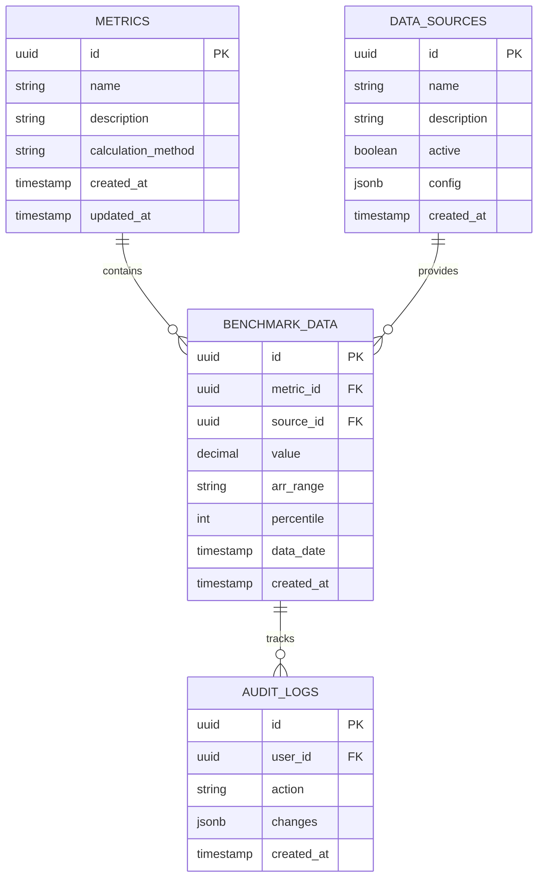
```mermaid
erDiagram
    METRICS {
        uuid id PK
        string name
        string description
        string calculation_method
        timestamp created_at
        timestamp updated_at
    }
    
    BENCHMARK_DATA {
        uuid id PK
        uuid metric_id FK
        uuid source_id FK
        decimal value
        string arr_range
        int percentile
        timestamp data_date
        timestamp created_at
    }
    
    DATA_SOURCES {
        uuid id PK
        string name
        string description
        boolean active
        jsonb config
        timestamp created_at
    }
    
    AUDIT_LOGS {
        uuid id PK
        uuid user_id FK
        string action
        jsonb changes
        timestamp created_at
    }
    
    METRICS ||--o{ BENCHMARK_DATA : contains
    DATA_SOURCES ||--o{ BENCHMARK_DATA : provides
    BENCHMARK_DATA ||--o{ AUDIT_LOGS : tracks
```

### 5.2.2 Indexing Strategy

| Table | Index | Type | Purpose |
|-------|-------|------|---------|
| benchmark_data | metric_id_arr_idx | B-tree | Filter by metric and ARR range |
| benchmark_data | data_date_idx | B-tree | Time-based queries |
| metrics | name_idx | B-tree | Metric name lookups |
| audit_logs | created_at_idx | B-tree | Audit trail queries |

## 5.3 API DESIGN

### 5.3.1 RESTful Endpoints

| Endpoint | Method | Description | Auth Required |
|----------|--------|-------------|---------------|
| /api/v1/metrics | GET | List all metrics | No |
| /api/v1/metrics/{id} | GET | Get metric details | No |
| /api/v1/benchmarks | GET | Get benchmark data | No |
| /api/v1/admin/data | POST | Import data | Yes |
| /api/v1/admin/sources | PUT | Update sources | Yes |

### 5.3.2 Request/Response Flow


```mermaid
sequenceDiagram
    participant C as Client
    participant G as API Gateway
    participant A as Auth Service
    participant M as Metrics Service
    participant D as Database
    participant R as Redis Cache

    C->>G: Request Metrics
    G->>A: Validate Token
    A->>G: Token Valid
    G->>R: Check Cache
    alt Cache Hit
        R->>G: Return Cached Data
    else Cache Miss
        G->>M: Request Metrics
        M->>D: Query Data
        D->>M: Return Data
        M->>R: Cache Data
        M->>G: Return Data
    end
    G->>C: Response
```

### 5.3.3 Data Models

```typescript
interface Metric {
  id: string;
  name: string;
  value: number;
  percentiles: {
    p5: number;
    p25: number;
    p50: number;
    p75: number;
    p90: number;
  };
  metadata: {
    source: string;
    arr_range: string;
    updated_at: string;
  };
}
```

### 5.3.4 Error Handling

| Status Code | Description | Example Response |
|-------------|-------------|------------------|
| 400 | Bad Request | `{"error": "Invalid ARR range"}` |
| 401 | Unauthorized | `{"error": "Invalid token"}` |
| 403 | Forbidden | `{"error": "Insufficient permissions"}` |
| 404 | Not Found | `{"error": "Metric not found"}` |
| 500 | Server Error | `{"error": "Internal server error"}` |

### 5.3.5 Rate Limiting

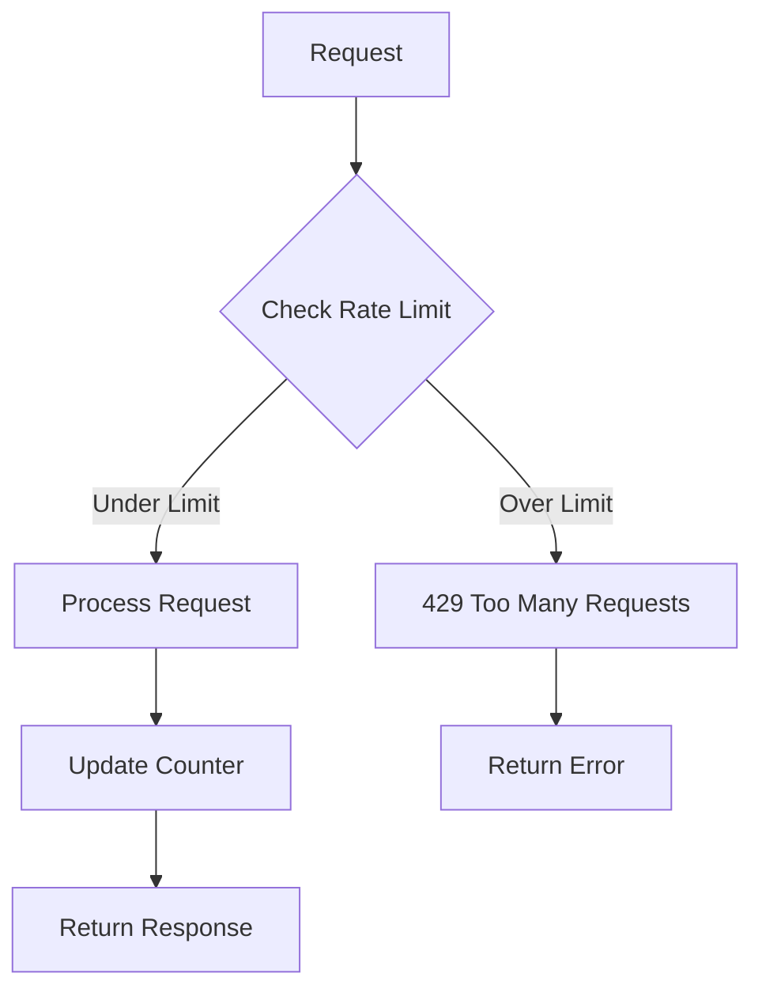
```mermaid
graph TD
    A[Request] --> B{Check Rate Limit}
    B -->|Under Limit| C[Process Request]
    B -->|Over Limit| D[429 Too Many Requests]
    C --> E[Update Counter]
    E --> F[Return Response]
    D --> G[Return Error]
```

| Endpoint Type | Rate Limit | Window |
|--------------|------------|--------|
| Public API | 100 | 1 minute |
| Admin API | 1000 | 1 minute |
| Export API | 10 | 1 minute |

# 6. USER INTERFACE DESIGN

## 6.1 Wireframe Key

```
Icons:
[?] - Help/Documentation
[$] - Financial/Metrics
[i] - Information tooltip
[+] - Add new data
[x] - Close/Delete
[<] [>] - Navigation
[^] - Upload data
[#] - Dashboard menu
[@] - Admin profile
[!] - Validation/Warning
[=] - Settings menu
[*] - Important metric

Interactive Elements:
[ ] - Checkbox
( ) - Radio button
[Button] - Clickable button
[...] - Text input field
[====] - Progress indicator
[v] - Dropdown menu
```

## 6.2 Public Interface

### 6.2.1 Main Dashboard

```
+----------------------------------------------------------+
|  SaaS Metrics Platform                [@] [?] [=]         |
+----------------------------------------------------------+
|                                                           |
| Filters:  ARR Range [v]  Metric [v]  Source [v]          |
|          [Apply Filters]        [Export Data]             |
+----------------------------------------------------------+
|                                                           |
|  +------------------+  +------------------+               |
|  | Revenue Growth   |  | NDR              |               |
|  | [$] 25%         |  | [$] 110%         |               |
|  |                 |  |                   |               |
|  | p90: 45%        |  | p90: 130%        |               |
|  | p75: 35%        |  | p75: 120%        |               |
|  | p50: 25%        |  | p50: 110%        |               |
|  | p25: 15%        |  | p25: 100%        |               |
|  | p05: 5%         |  | p05: 90%         |               |
|  |                 |  |                   |               |
|  | [i] View Detail |  | [i] View Detail  |               |
|  +------------------+  +------------------+               |
|                                                           |
|  +------------------+  +------------------+               |
|  | Magic Number     |  | EBITDA Margin    |               |
|  | [$] 0.8         |  | [$] 15%          |               |
|  |                 |  |                   |               |
|  | p90: 1.2        |  | p90: 25%         |               |
|  | p75: 1.0        |  | p75: 20%         |               |
|  | p50: 0.8        |  | p50: 15%         |               |
|  | p25: 0.6        |  | p25: 10%         |               |
|  | p05: 0.4        |  | p05: 5%          |               |
|  |                 |  |                   |               |
|  | [i] View Detail |  | [i] View Detail  |               |
|  +------------------+  +------------------+               |
|                                                           |
+----------------------------------------------------------+
```

### 6.2.2 Metric Detail View

```
+----------------------------------------------------------+
|  [<] Back to Dashboard    Metric: Revenue Growth          |
+----------------------------------------------------------+
|                                                           |
| Current Filters:                                          |
| ARR: $1M-$5M  |  Source: Source X  |  [Clear Filters]    |
+----------------------------------------------------------+
|                                                           |
|  Distribution Chart                                       |
|  +------------------------------------------------+      |
|  |                      *                          |      |
|  |                   *     *                       |      |
|  |                *           *                    |      |
|  |             *                 *                 |      |
|  |          *                       *             |      |
|  |       *                             *          |      |
|  +------------------------------------------------+      |
|    0%   10%   20%   30%   40%   50%   60%   70%         |
|                                                           |
|  Percentile Data:                                        |
|  +------------------------------------------------+      |
|  | Percentile | Value | Industry Average | Delta  |      |
|  |-----------|--------|-----------------|---------|      |
|  | P90       | 45%    | 40%             | +5%    |      |
|  | P75       | 35%    | 32%             | +3%    |      |
|  | P50       | 25%    | 25%             | 0%     |      |
|  | P25       | 15%    | 18%             | -3%    |      |
|  | P05       | 5%     | 8%              | -3%    |      |
|  +------------------------------------------------+      |
|                                                           |
|  [Export Detail] [Share View]                            |
+----------------------------------------------------------+
```

## 6.3 Administrative Interface

### 6.3.1 Admin Dashboard

```
+----------------------------------------------------------+
|  Admin Dashboard                     [@Admin] [?] [x]      |
+----------------------------------------------------------+
|                                                           |
| [#] Menu                                                  |
| +------------------+                                      |
| |-- Dashboard      |   Quick Actions:                     |
| |-- Metrics        |   [+] Add New Metric                 |
| |-- Data Sources   |   [^] Import Data                    |
| |-- Audit Logs     |   [$] Update Benchmarks             |
| |-- Settings       |                                      |
| +------------------+                                      |
|                                                           |
| Recent Activity:                                          |
| +------------------------------------------------+       |
| | Timestamp  | User    | Action         | Status  |       |
| |-----------|---------|----------------|---------|       |
| | 10:15 AM  | admin1  | Import Data    | Success |       |
| | 09:30 AM  | admin2  | Update Metric  | Success |       |
| | 09:00 AM  | system  | Backup         | Success |       |
| +------------------------------------------------+       |
|                                                           |
| System Status:                                            |
| Database: [====] 98% Healthy                              |
| Cache: [====] 100% Operational                            |
| API: [====] 99% Uptime                                    |
+----------------------------------------------------------+
```

### 6.3.2 Data Import Interface

```
+----------------------------------------------------------+
|  Data Import                         [@Admin] [?] [x]      |
+----------------------------------------------------------+
|                                                           |
| Import Method:                                            |
| (•) CSV Upload                                            |
| ( ) Manual Entry                                          |
| ( ) API Integration                                       |
|                                                           |
| File Selection:                                           |
| +------------------------------------------------+       |
| |  [^] Drag and drop files here or click to upload |       |
| |                                                  |       |
| |  Supported formats: .csv, .xlsx                  |       |
| +------------------------------------------------+       |
|                                                           |
| Validation Rules:                                         |
| [x] Validate metric names                                 |
| [x] Check value ranges                                    |
| [x] Verify data sources                                   |
| [x] Format timestamps                                     |
|                                                           |
| Progress:                                                 |
| [=================                    ] 45%               |
| Processing row 450 of 1000                               |
|                                                           |
| [!] Validation Errors:                                    |
| - Row 23: Invalid metric value                           |
| - Row 45: Missing source reference                       |
|                                                           |
| [Cancel Import] [Pause] [Continue]                        |
+----------------------------------------------------------+
```

## 6.4 Responsive Design Breakpoints

```
Desktop (1024px+)
+------------------+------------------+------------------+
|     Metric 1     |     Metric 2     |     Metric 3     |
+------------------+------------------+------------------+

Tablet (768px - 1023px)
+------------------+------------------+
|     Metric 1     |     Metric 2     |
+------------------+------------------+
|     Metric 3     |     Metric 4     |
+------------------+------------------+

Mobile (320px - 767px)
+------------------+
|     Metric 1     |
+------------------+
|     Metric 2     |
+------------------+
|     Metric 3     |
+------------------+
```

## 6.5 Component Specifications

| Component | Framework | Props/Configuration |
|-----------|-----------|-------------------|
| Metric Card | Material-UI Card | elevation: 2, padding: 16px |
| Data Grid | Material-UI DataGrid | sortable: true, filterable: true |
| Charts | Chart.js | responsive: true, maintainAspectRatio: false |
| Dropdowns | Material-UI Select | variant: "outlined", fullWidth: true |
| Buttons | Material-UI Button | variant: "contained", size: "medium" |
| Icons | Material-UI Icons | size: "small", color: "primary" |

# 7. SECURITY CONSIDERATIONS

## 7.1 AUTHENTICATION AND AUTHORIZATION

### 7.1.1 Authentication Flow

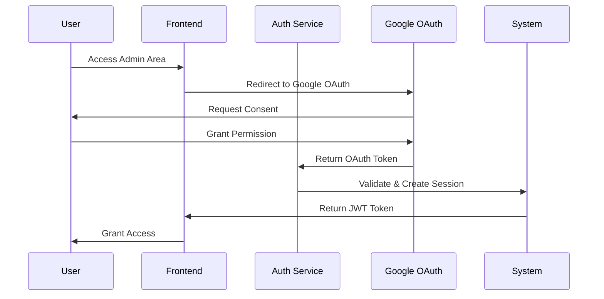
```mermaid
sequenceDiagram
    participant U as User
    participant F as Frontend
    participant A as Auth Service
    participant G as Google OAuth
    participant S as System

    U->>F: Access Admin Area
    F->>G: Redirect to Google OAuth
    G->>U: Request Consent
    U->>G: Grant Permission
    G->>A: Return OAuth Token
    A->>S: Validate & Create Session
    S->>F: Return JWT Token
    F->>U: Grant Access
```

### 7.1.2 Authorization Matrix

| Role | View Metrics | Export Data | Manage Data | Admin Panel | User Management |
|------|--------------|-------------|-------------|-------------|-----------------|
| Public User | ✓ | ✓ | ✗ | ✗ | ✗ |
| Admin | ✓ | ✓ | ✓ | ✓ | ✗ |
| Super Admin | ✓ | ✓ | ✓ | ✓ | ✓ |

### 7.1.3 Session Management

| Component | Specification |
|-----------|--------------|
| Token Type | JWT (JSON Web Token) |
| Token Expiry | 30 minutes |
| Refresh Token | 7 days |
| Session Storage | Redis |
| Concurrent Sessions | Maximum 3 |

## 7.2 DATA SECURITY

### 7.2.1 Data Classification

| Data Type | Classification | Storage Requirements | Access Control |
|-----------|---------------|---------------------|----------------|
| Benchmark Data | Public | Standard Encryption | Public Read |
| User Credentials | Restricted | AES-256 Encryption | Auth Service Only |
| Admin Actions | Confidential | Encrypted + Audit Log | Admin Access Only |
| System Logs | Internal | Encrypted Storage | System Access Only |

### 7.2.2 Encryption Standards

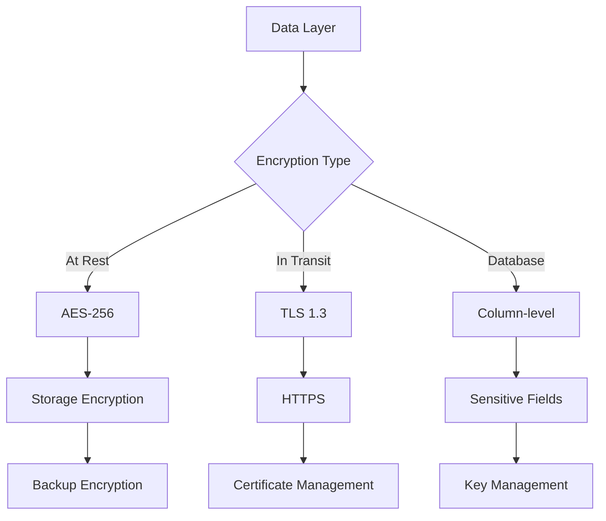
```mermaid
graph TD
    A[Data Layer] --> B{Encryption Type}
    B -->|At Rest| C[AES-256]
    B -->|In Transit| D[TLS 1.3]
    B -->|Database| E[Column-level]
    
    C --> F[Storage Encryption]
    D --> G[HTTPS]
    E --> H[Sensitive Fields]
    
    F --> I[Backup Encryption]
    G --> J[Certificate Management]
    H --> K[Key Management]
```

### 7.2.3 Key Management

| Component | Implementation |
|-----------|---------------|
| Key Storage | HashiCorp Vault |
| Key Rotation | 90 days |
| Backup Keys | Geographically distributed |
| Access Control | Role-based with MFA |

## 7.3 SECURITY PROTOCOLS

### 7.3.1 API Security

| Measure | Implementation |
|---------|---------------|
| Rate Limiting | 100 requests/minute per IP |
| Input Validation | Server-side validation with sanitization |
| CORS Policy | Whitelist of approved domains |
| API Authentication | JWT with signature verification |

### 7.3.2 Infrastructure Security

```mermaid
graph TB
    subgraph Security Layers
        A[WAF] --> B[Load Balancer]
        B --> C[API Gateway]
        C --> D[Application]
        D --> E[Database]
    end
    
    subgraph Security Measures
        F[DDoS Protection]
        G[IP Filtering]
        H[Request Validation]
        I[Access Control]
        J[Data Encryption]
    end
    
    A --- F
    B --- G
    C --- H
    D --- I
    E --- J
```

### 7.3.3 Monitoring and Incident Response

| Component | Implementation | Frequency |
|-----------|---------------|-----------|
| Security Scanning | OWASP ZAP | Weekly |
| Dependency Audit | npm audit | Daily |
| Log Analysis | ELK Stack | Real-time |
| Vulnerability Assessment | Snyk | On deployment |
| Incident Response | PagerDuty | 24/7 |

### 7.3.4 Compliance Controls

| Requirement | Implementation |
|-------------|---------------|
| Access Logging | All admin actions logged with user ID, timestamp, and IP |
| Data Retention | Automated purge after retention period |
| Audit Trail | Immutable logs stored for 3 years |
| Privacy Controls | GDPR and CCPA compliance measures |
| Security Headers | HSTS, CSP, X-Frame-Options configured |

# 8. INFRASTRUCTURE

## 8.1 DEPLOYMENT ENVIRONMENT

```mermaid
graph TD
    subgraph Production Environment
        A[Replit Infrastructure] --> B[Application Layer]
        B --> C[Web Service]
        B --> D[API Services]
        A --> E[Data Layer]
        E --> F[PostgreSQL]
        E --> G[Redis Cache]
    end
    
    subgraph Development Environment
        H[Local Development] --> I[Docker Compose]
        I --> J[Local Services]
        J --> K[PostgreSQL Container]
        J --> L[Redis Container]
    end
```

| Environment | Description | Configuration |
|-------------|-------------|---------------|
| Production | Replit-hosted infrastructure | - High availability setup<br>- Auto-scaling enabled<br>- Geographic redundancy |
| Staging | Replit development environment | - Identical to production<br>- Reduced resources<br>- Test data only |
| Development | Local Docker environment | - Docker Compose setup<br>- Local services<br>- Development tools |

## 8.2 CLOUD SERVICES

| Service | Provider | Purpose | Justification |
|---------|----------|---------|---------------|
| Database | Neon PostgreSQL | Primary data storage | - Serverless scaling<br>- Built-in backups<br>- Replit integration |
| Cache | Upstash Redis | Data caching | - Serverless Redis<br>- Pay-per-use model<br>- REST API support |
| Storage | Cloudflare R2 | Static assets & backups | - S3-compatible<br>- Lower egress costs<br>- Global CDN |
| Monitoring | DataDog | System monitoring | - Comprehensive metrics<br>- Log aggregation<br>- APM capabilities |

## 8.3 CONTAINERIZATION

```mermaid
graph LR
    subgraph Container Architecture
        A[Base Image] --> B[Node.js Image]
        B --> C[Application Image]
        C --> D[Web Service]
        C --> E[API Service]
        C --> F[Worker Service]
    end
```

| Component | Image Specification | Configuration |
|-----------|-------------------|----------------|
| Base Image | node:18-alpine | - Minimal footprint<br>- Security hardened |
| Web Service | Custom Dockerfile | - Multi-stage build<br>- Production optimized |
| API Service | Custom Dockerfile | - Shared base layer<br>- Service-specific deps |
| Worker Service | Custom Dockerfile | - Background processing<br>- Queue handling |

## 8.4 ORCHESTRATION

| Component | Configuration | Purpose |
|-----------|--------------|---------|
| Service Discovery | Internal DNS | Service location and routing |
| Load Balancing | Replit internal | Traffic distribution |
| Health Checks | HTTP/TCP probes | Service availability monitoring |
| Scaling | Horizontal auto-scaling | Resource optimization |
| Failover | Automatic service recovery | High availability |

## 8.5 CI/CD PIPELINE

```mermaid
graph LR
    A[Code Push] --> B[GitHub Actions]
    B --> C{Tests Pass?}
    C -->|Yes| D[Build Images]
    C -->|No| E[Notify Failure]
    D --> F[Push to Registry]
    F --> G{Branch?}
    G -->|Main| H[Deploy Production]
    G -->|Develop| I[Deploy Staging]
    H & I --> J[Post-Deploy Tests]
    J --> K{Tests Pass?}
    K -->|No| L[Rollback]
    K -->|Yes| M[Monitor]
```

### 8.5.1 Pipeline Stages

| Stage | Tools | Actions |
|-------|-------|---------|
| Code Quality | ESLint, Prettier | - Lint checking<br>- Code formatting<br>- Static analysis |
| Testing | Jest, Supertest | - Unit tests<br>- Integration tests<br>- E2E tests |
| Security | Snyk, OWASP | - Dependency scanning<br>- Security testing<br>- Vulnerability checks |
| Build | Docker | - Image building<br>- Layer optimization<br>- Version tagging |
| Deploy | GitHub Actions | - Environment selection<br>- Deployment execution<br>- Health verification |

### 8.5.2 Deployment Configuration

| Environment | Trigger | Validation | Rollback |
|-------------|---------|------------|-----------|
| Staging | Push to develop | Automated tests | Automatic |
| Production | Manual approval | Full test suite | Manual with automated revert |
| Feature | PR creation | Unit tests | Automatic |

### 8.5.3 Monitoring Integration

| Metric | Tool | Threshold |
|--------|------|-----------|
| Error Rate | DataDog | < 0.1% |
| Response Time | DataDog APM | < 500ms |
| CPU Usage | System Metrics | < 80% |
| Memory Usage | System Metrics | < 85% |
| Deployment Success | GitHub Actions | 100% |

# APPENDICES

## A.1 ADDITIONAL TECHNICAL INFORMATION

### A.1.1 Metric Calculation Methods

| Metric | Calculation Method | Data Points Required |
|--------|-------------------|---------------------|
| Revenue Growth Rate | ((Current ARR - Previous ARR) / Previous ARR) × 100 | Current and previous period ARR |
| Net Dollar Retention | ((Beginning ARR + Expansion - Contraction - Churn) / Beginning ARR) × 100 | Beginning ARR, expansions, contractions, churn |
| Magic Number | Net New ARR / Sales & Marketing Spend | New ARR, S&M spend |
| EBITDA Margin | (EBITDA / Revenue) × 100 | EBITDA, revenue |
| ARR per Employee | Total ARR / Full-time Employee Count | ARR, employee count |

### A.1.2 Data Import Specifications

```mermaid
flowchart TD
    A[CSV Upload] --> B{File Validation}
    B -->|Valid| C[Header Check]
    B -->|Invalid| D[Error: Invalid Format]
    C -->|Valid| E[Data Type Check]
    C -->|Invalid| F[Error: Invalid Headers]
    E -->|Valid| G[Business Rule Validation]
    E -->|Invalid| H[Error: Data Type Mismatch]
    G -->|Valid| I[Import Processing]
    G -->|Invalid| J[Error: Business Rule Violation]
    I --> K[Success]
```

## A.2 GLOSSARY

| Term | Definition |
|------|------------|
| Benchmark Data | Statistical data points used for comparative analysis |
| Business Rule | Logical constraints applied to data validation |
| Cold Storage | Long-term data storage for infrequently accessed data |
| Data Distribution | Statistical spread of values across percentiles |
| Hot Data | Frequently accessed data stored in high-speed cache |
| Percentile | Value below which a percentage of observations fall |
| Rate Limiting | Controlling the number of requests a user can make |
| Soft Delete | Marking records as deleted without physical removal |
| Warm Data | Moderately accessed data in primary storage |

## A.3 ACRONYMS

| Acronym | Full Form |
|---------|-----------|
| ACID | Atomicity, Consistency, Isolation, Durability |
| APM | Application Performance Monitoring |
| CDN | Content Delivery Network |
| CORS | Cross-Origin Resource Sharing |
| CSP | Content Security Policy |
| CRUD | Create, Read, Update, Delete |
| ELK | Elasticsearch, Logstash, Kibana |
| HSTS | HTTP Strict Transport Security |
| JSON | JavaScript Object Notation |
| JSONB | JSON Binary |
| JWT | JSON Web Token |
| MFA | Multi-Factor Authentication |
| MTBF | Mean Time Between Failures |
| MTTR | Mean Time To Recovery |
| RBAC | Role-Based Access Control |
| REST | Representational State Transfer |
| S3 | Simple Storage Service |
| SSL | Secure Sockets Layer |
| TTL | Time To Live |
| WAF | Web Application Firewall |
| WSS | WebSocket Secure |

## A.4 REFERENCE ARCHITECTURE

```mermaid
graph TB
    subgraph Frontend Layer
        A[React Application]
        B[Material-UI Components]
        C[Redux Store]
    end
    
    subgraph API Layer
        D[Express API Gateway]
        E[Authentication Service]
        F[Metrics Service]
    end
    
    subgraph Data Layer
        G[PostgreSQL]
        H[Redis Cache]
        I[S3 Storage]
    end
    
    subgraph Security Layer
        J[OAuth 2.0]
        K[JWT Handler]
        L[Rate Limiter]
    end
    
    A --> D
    B --> A
    C --> A
    D --> E
    D --> F
    E --> J
    F --> G
    F --> H
    F --> I
    J --> K
    D --> L
```